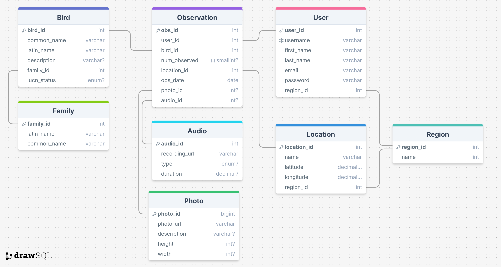

# Natural Language (AI) SQL Project - eBird Birdwatching Database
## Purpose
I love birds, and lately have been birdwatching a lot. There's a great platform called eBird that birdwatchers and ornithologists use to record their sightings of birds. There's a lot of data to be stored and used, and I thought it was a good challenge to model a simple database schema.

## Schema


## Successful Result
### ```Which user has the most observations outside of their own region?```
- Query:
```sql
WITH topfive AS (
  SELECT * FROM segment
  WHERE segment.id != '267:476'
  ORDER BY embedding <-> (SELECT embedding from segment where id = '267:476')
  LIMIT 5
)
SELECT podcast.title, topfive.id, content, start_time, end_time, embedding <-> (SELECT embedding from segment where topfive.id = '267:476') AS distance
FROM topfive
JOIN podcast ON topfive.podcast_id = podcast.id
ORDER BY embedding <-> (SELECT embedding from segment where segment.id = '267:476');
```
- Response: ```[('crane.craig12', 4)]```

## Unsuccessful Result
### ```How many birds are missing photo and audio recordings?```
- Results:
  1. Query:
      ```sql
      SELECT COUNT(*) 
      FROM Bird b
      LEFT JOIN Observation o ON b.bird_id = o.bird_id
      WHERE o.photo_id IS NULL AND o.audio_id IS NULL;
      ```
      Result: ```27 birds are missing photo and audio recordings.```
  
  2. Query:
      ```sql
      SELECT COUNT(*) 
      FROM Observation 
      WHERE photo_id IS NULL 
      AND audio_id IS NULL;
      ```
      Result: ```24 birds are missing photo and audio recordings.```

- Analysis: ChatGPT got it wrong both times (there are only 18 birds total!), maybe because the question was too hard. I wrote a solution that used a subquery. The second result was a count of 24 birds because ChatGPT wrote a SQL query that looked at all of the observations where photo_id and audio_id were NULL. This approach didn't work because there are multiple observations of the same bird with no photo or audio. The second time it joined the Bird table with the Observation table to count the same 24 observations without audio and photos, but the left join meant that birds without observations were counted, resulting in a count of 27.

- My solution (With a result of 7 birds):
  ```sql
  SELECT COUNT(*) FROM (
    SELECT b.common_name, 
      SUM(IIF(o.photo_id IS NULL, 0, 1)) photo_count, 
      SUM(IIF (o.audio_id IS NULL, 0, 1)) audio_count 
    FROM Bird b
    LEFT JOIN Observation o ON o.bird_id = b.bird_id
    GROUP BY o.bird_id
  ) counts
  WHERE photo_count = 0 AND audio_count = 0;
  ```

## Questions With Mixed Results
### ```Which birds have been observed the most?```
- Results: 
  1. ```Bald Eagle has been observed the most, with 4 sightings.```
  2. ```The most observed birds are the Bald Eagle, Cooper's Hawk, Ruby-throated Hummingbird, and Rock Pigeon, each spotted 4 times.```
- Analysis: The first time, ChatGPT generated a SQL query that included a ```RESTRICT 1``` constraint. This is not what I was looking for with the question "Which **birds** have been observed the most." The second time it gave me the answer that I was looking for, but somehow overcompensated and returned a lot of birds in the raw query output, returning a list of all of the counts for all birds.

---

### ```Which birds have been observed in at least two regions?```
- Query: 
```sql
ite
SELECT b.common_name, b.latin_name
FROM Bird b
JOIN Observation o ON b.bird_id = o.bird_id
JOIN Location l ON o.location_id = l.location_id
GROUP BY b.bird_id
HAVING COUNT(DISTINCT l.region_id) >= 2;
```
- Response: ```27 birds are missing photo and audio recordings.```
- Error: ```near \"ite\": syntax error".```

What happened here was incorrect parsing of the SQL code from the response from ChatGPT. I believe the query would have worked but the syntax error caused it to put out the same answer as the question before it.

## Other Successful Results
### ```Is there one family that is observed more than others?```
- Query: 
```sql
SELECT f.common_name, COUNT(o.obs_id) AS observations_count
FROM Family f
JOIN Bird b ON f.family_id = b.family_id
JOIN Observation o ON b.bird_id = o.bird_id
GROUP BY f.family_id
ORDER BY observations_count DESC
LIMIT 1;
```
- Response: ```The most observed family is "Hawks, Eagles, and Kites" with 10 sightings.```

---

### ```Which location has the most observations?```
- Query: 
```sql
SELECT Location.name, COUNT(Observation.obs_id) as observation_count
FROM Observation
JOIN Location ON Observation.location_id = Location.location_id
GROUP BY Location.location_id
ORDER BY observation_count DESC
LIMIT 1;
```
- Response: ```El Triunfo Biosphere Reserve with 9 observations.```

---

### ```Are there any birds that have been observed in three regions?```
- Query: 
```sql
SELECT Bird.common_name, Bird.latin_name
FROM Bird
JOIN Observation ON Bird.bird_id = Observation.bird_id
JOIN Location ON Observation.location_id = Location.location_id
GROUP BY Bird.bird_id
HAVING COUNT(DISTINCT Location.region_id) >= 3;
```
- Response: ```Sure! The American Wigeon and Bald Eagle have been observed in three regions.```

---

### ```Which birds in the database have not been observed?```
- Query: 
```sql
SELECT Bird.common_name, Bird.latin_name
FROM Bird
LEFT JOIN Observation ON Bird.bird_id = Observation.bird_id
WHERE Observation.bird_id IS NULL;
```
- Response: ```Sure! The birds you mentioned are the Canada Goose, Eurasian Collared-Dove, and Mourning Dove.```
- Note: The observation data was randomly generated, but in reality these birds are some of the most common out of all of them xD

---

### ```Which users have uploaded photos or audio recordings in their observations?```
- Query: 
```sql
SELECT DISTINCT u.username
FROM User u
JOIN Observation o ON u.user_id = o.user_id
WHERE o.photo_id IS NOT NULL OR o.audio_id IS NOT NULL;
```
- Response: ```Users who have uploaded photos or audio recordings are: robin_rachel, avianAle, hawkHope_89, jakeJay, crane.craig12, sam.swift, feathered.fred23, frida_finch, and warbler_will.```

---