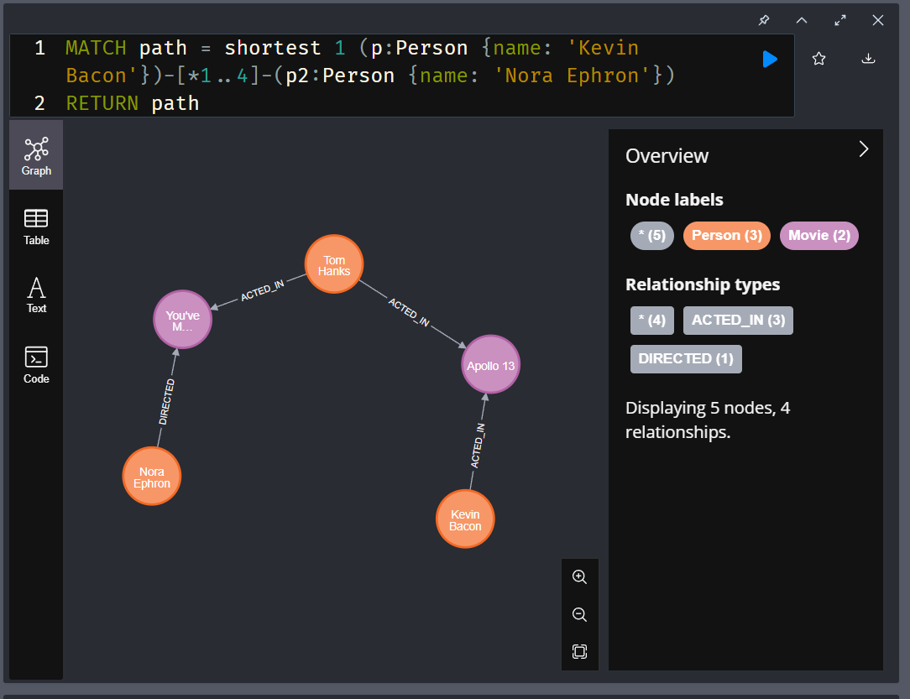
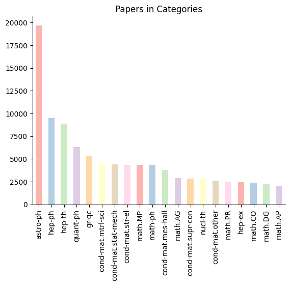
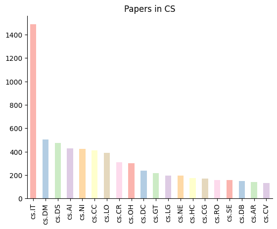
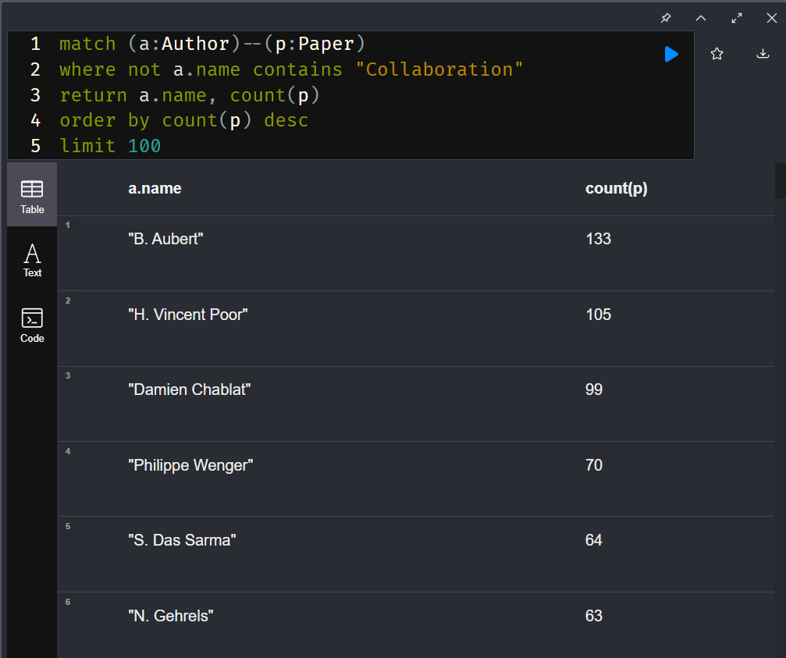

# Neo4j

1. Graph of the Bacon Path for Nora Ephron using the Movies dataset - a screen shot of the Neo4j Browser with the graph is sufficient.
    - 
2. A screen shot of the inDegree vs Category Name chart from your working jupyter notebook for the ArXiv tutorial (linked at the beginning). This is a bar chart, not a graph of all the papers.
    
    
3. Report the total number of papers from all cs categories as one total amount. 
    - 7891 total papers
4. The query used to get the total number of papers in all cs categories as one total amount from number 3.
     ```
      match (p:Paper)--(c:Category)
      where c.category starts with 'cs'
      return count(p)
    ```
    - This query returns all papers, double counting papers published in multiple categories. Adding the 'distinct' keyword to the return statement returns 5812 total papers.
    
5. Have fun and experiment with this technology, do something, or query something that would be interesting to you!
    - I made a query that returns the authors with the most papers published. I excluded any "collaboration" authors as there were quite a few and I was interested in individual people.
    