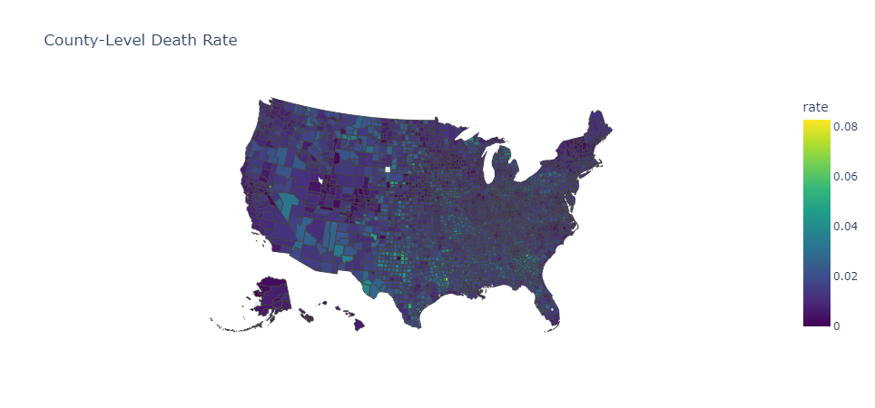

# SparkSQL with U.S. Counties Covid Dataset

1. Write code to define or infer the schema and then read in the dataset
    ```py
    # Read the file into a Spark DataFrame
    usCountiesFilePath = "./uscounties.csv"
    from pyspark.sql.types import DateType, StringType, StructField, StructType, IntegerType

    # the fips column needs to be a string in order to preserve leading zeros
    schema = StructType([StructField('date', DateType(), True), StructField('county', StringType(), True), StructField('state', StringType(), True), StructField('fips', StringType(), True), StructField('cases', IntegerType(), True), StructField('deaths', IntegerType(), True)])

    df = spark.read.csv(usCountiesFilePath, schema=schema, header=True)
    ```

2. Write code to find the county with the most deaths
    ```py
      df.createOrReplaceTempView("covid")  # create table that you can do sql on

      print("Max deaths:")
      spark.sql(
          """
          select county, state, deaths
          from covid
          order by deaths desc
          limit 1
        """
      ).show()
    ```

      |        county |    state | deaths |
      | ------------- | -------- | ------ |
      | New York City | New York |  40267 |


3. Write code to find the county with the most cases
    ```py
    print("Max cases:")
    spark.sql(
        """
        select county, state, cases
        from covid
        order by cases desc
        limit 1
      """
    ).show()
    ```

    |      county |      state |   cases |
    | ----------- | ---------- | ------- |
    | Los Angeles | California | 2908425 |

4. Write code to find the total number of deaths in Utah county
    ```py
    print("Total deaths in Utah County:")
    spark.sql(
        """
        select county, state, deaths
        from covid
        where county='Utah' and date='2022-05-13'
      """
    ).show()
    ```

    | county | state | deaths | 
    | ------ | ----- | ------ | 
    |   Utah |  Utah | 791    | 

5. Write code to find the death rate for each state and sort the states by death rate descending
    ```py
    print("Death rate for each state:")
    spark.sql(
        """
        select state, sum(deaths) / sum(cases) as rate
        from covid
        where date='2022-05-13'
        group by state
        order by rate desc
      """
    ).show()
    ```

     |         state |                 rate | 
     | ------------- | -------------------- | 
     |  Pennsylvania | 0.015722318331513083 | 
     |   Mississippi | 0.015541584999631953 | 
     |       Alabama | 0.015043956128181742 | 
     |        Nevada | 0.014900913477587933 | 
     |       Arizona | 0.014884843113359676 | 
     |       Georgia | 0.014874971808464166 | 
     |      Michigan | 0.014616217125644464 | 
     |    New Jersey | 0.014498962846650889 | 
     |    New Mexico | 0.014462012745729724 | 
     |      Missouri | 0.014159391860103612 | 
     |          Ohio |  0.01415176937498371 | 
     |   Connecticut | 0.014002001385574628 | 
     |     Louisiana | 0.013898007349590935 | 
     |      Maryland | 0.013799618514678251 | 
     |       Indiana | 0.013787799751901293 | 
     |      Oklahoma | 0.013771585140095712 | 
     | West Virginia | 0.013635248690478075 | 
     |      Arkansas |  0.01361763958527935 | 
     |     Tennessee | 0.013055661731134637 | 
     |         Texas | 0.013021050347158319 | 
    
    only showing top 20 rows

6. Write code to something else interesting with this data – your choice
    ```py
    print("Top days with the highest case increases in Utah County:")
    spark.sql(
        """
        select curr.date, curr.cases - prev.cases as case_increase
        from covid curr
        left join covid prev on prev.date = curr.date - 1
        where curr.county='Utah' and prev.county='Utah'
        order by case_increase desc
        limit 10
      """
    ).show()
    ```

     |       date | case_increase | 
     | ---------- | ------------- | 
     | 2022-01-18 |          8221 | 
     | 2022-01-24 |          4756 | 
     | 2022-01-10 |          4463 | 
     | 2022-01-19 |          2990 | 
     | 2022-01-21 |          2716 | 
     | 2022-01-20 |          2625 | 
     | 2022-01-03 |          2569 | 
     | 2022-01-13 |          2563 | 
     | 2022-01-14 |          1984 | 
     | 2022-01-31 |          1911 | 
     | 2021-01-13 |          1878 | 
     | 2022-01-07 |          1848 | 
     | 2022-01-11 |          1766 | 
     | 2022-01-12 |          1628 | 
     | 2022-01-06 |          1620 | 
     | 2022-01-25 |          1598 | 
     | 2022-01-27 |          1542 | 
     | 2020-11-27 |          1482 | 
     | 2022-01-26 |          1425 | 
     | 2020-11-14 |          1335 | 

      only showing top 20 rows

7. Extra Credit 1 - Plot your death rate data!
    ```py
    import plotly.express as px

    county_death_rate = spark.sql(
      """
        select fips, deaths / cases as rate
        from covid
        where fips is not Null and date='2022-05-13'
      """
    )

    deathrate_pd = county_death_rate.toPandas()

    fig = px.choropleth(
        deathrate_pd,
        geojson="https://raw.githubusercontent.com/plotly/datasets/master/geojson-counties-fips.json",  # GeoJSON for counties
        locations='fips',  # Use county FIPS codes
        color='rate',  # Column to determine color intensity
        color_continuous_scale='Viridis',
        scope='usa',
        title='County-Level Death Rate'
    )

    fig.show()
    ```

    