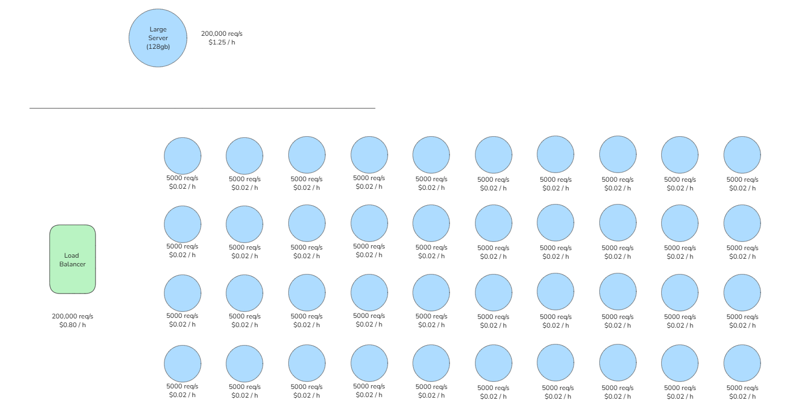
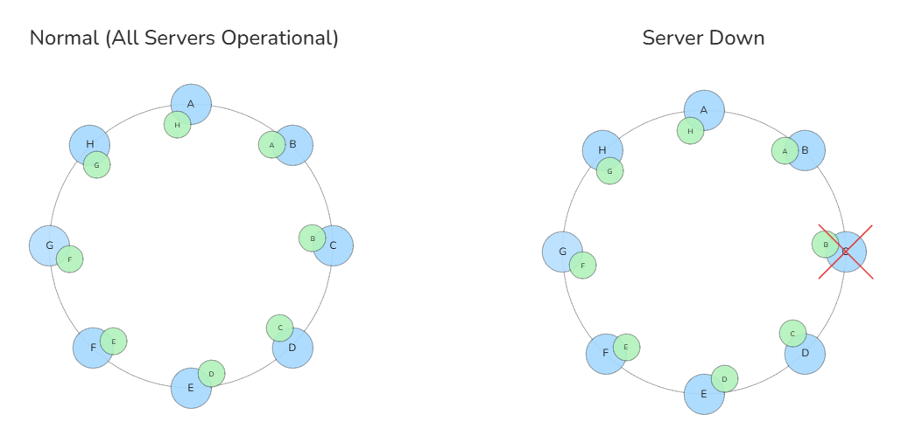
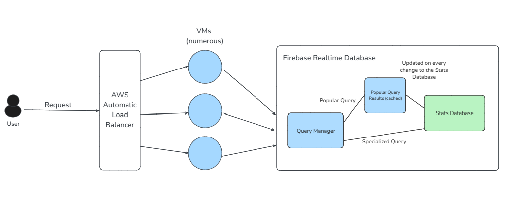

# Scaling

## Learning Goals
- Gain a working understanding of scaling up versus scaling out.
- Understand cloud computing costs

## Situation
You have a growing successful company that sells books online. You are using a single server that hosts an in-memory database of 128 Gb. It has 32 cores and is able to successfully respond to 200,000 requests per second and only costs $1.25 per hour. However, your customer base is growing and you are getting issues where at peek load times people are getting errors as the single server just cannot process requests fast enough. 

There are no available hardware options to scale up, you already have the best and fastest server available. 

You are asked to design a "scale-out" solution using cloud 1-core VMs that each can take about 5000 requests per second and have 2Gb memory and only cost $.02 per hour each. Your friend says you can use his network load balancer system (for free) which has a capability of distributing requests to a random server in your group of servers.

## Deliverables
1. Design a system using smaller VMs and a load balancer to replace the single large server. Draw a picture and explain how it works.

    - This is what I came up with for my scaled up system: 40 VMs that can handle the same number of requests per second. Requests come into the server through the load balancer, which determines which VM to send the request to based on server demand.

2. Compare costs between the two systems per hour.
    - Generally a horizontally scaled server is cheaper than a single server, and at a certain number of requests per second, the single machine server will not be able to compare with the horizontally scaled server.

3. Describe costs and needed VMs to handle 200,000 requests per second (RPS) in your distributed system.
    - Needed VMs: 40.
    - Costs: $0.80 per hour.

4. Describe costs and needed VMs to handle 10,000,000 requests per second (RPS) in your distributed system.
    - Needed VMs: 2,000.
    - Costs: $40 per hour.

---

# Reliable Systems

## Situation

You have a horizontally scaled data reading and writing system that consists of many nodes arranged in a ring using consistent hashing. You manage load by horizontally scaling, consistent hashing, and a network load balancer.

You find that about once every three months one of the servers might go down or have some issues. This causes huge issues for your customers when this happens. You want to design a system that keeps your system available with zero downtime even when a single server goes down.

## Deliverables

1. Design a system that allows for a nodes to temporarily go down while still giving read and write access to your data with zero downtime. Draw pictures and explain how it works.

- I made this design with the fact that occasionally one server will go down. Each server node has a backup copy of its neighbor's data. In the example shown where server 'C' goes down, requests for data in 'C' will be served from server 'D', which has the backup for 'C'. In cases where more than one server would go down at a time, more backups could be implemented on each server but in this case one backup is enough.

---

# System Design

## Situation
An investor asks you to take $1,000,000 (one million dollars) and deploy a website that hosts realtime stats for all events in the next Winter Olympics including leaderboards by different categories. Some quick research tells you you can expect about 360,000,000 requests per day during 17 days of the olympic games. 

## Deliverable
Make a system design for the "realtime olympics stats dashboard" and identify any bottlenecks and scaling constraints. Identify any security boundaries and explain how security is maintained. Identify costs for maintaining the site at peak load for 17 days and half load for 17 more days. Draw a picture and label each component and technology. Include a table of technologies you'll use and the associated costs (show your work on how you calculate these costs).

The optimization that I think would be the most useful for this scenario is having a table with the results of the most popular requests (i.e. medal count by country, scores by event, etc), reducing the number of direct requests to the database itself. The popular request table would be updated every time the database is updated.
Requests to the website would go through a load balancer, the one I picked is AWS's Automatic Load Balancer because it's the one I've worked with. I've been having trouble calculating the price of using these services because I don't know how many gigabytes of storage to work with, but I looked at a few different websites like [this one for firebase realtime db](https://airbyte.com/data-engineering-resources/firebase-database-pricing) and [this one for Cloud Computing in general](https://www.cloudzero.com/blog/cost-of-cloud-computing/)

| Technology  | Notes | Estimated Cost |
| ----------- | ----- | -------------- |
| Firebase Realtime Database | NoSql database that sends updates in real time, designed for this sort of use case | ~$1500 |
| AWS Automatic Load Balancer (ALB) | Distributes traffic across servers  | ~$500 |
| Cloudflare CDN | Domain name and Ddos protection | ~$1000 |
| Prometheus / Grafana | Logging and monitoring | ~$200 |

Bottlenecks / Concerns: I think there would be a risk of too many people overwhelming the database, Firebase can support up to 200,000 simultaneous connections and can scale up a bit if you have multiple instances of the database, but I'm not sure how many users exactly there would be. 